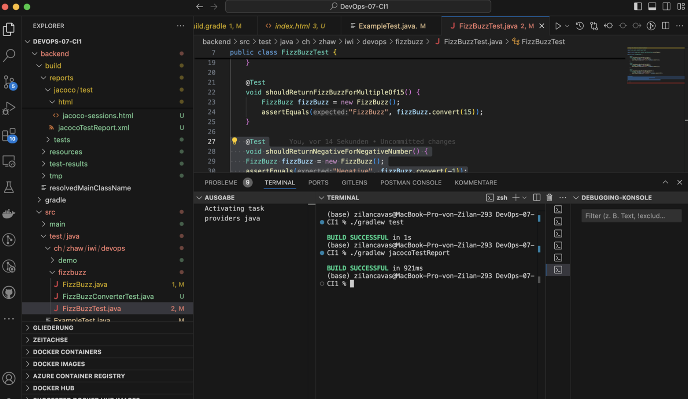
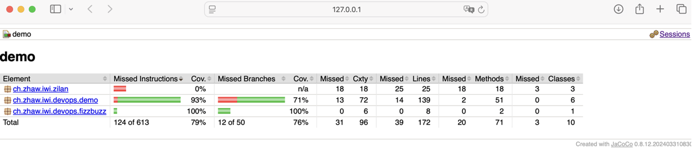
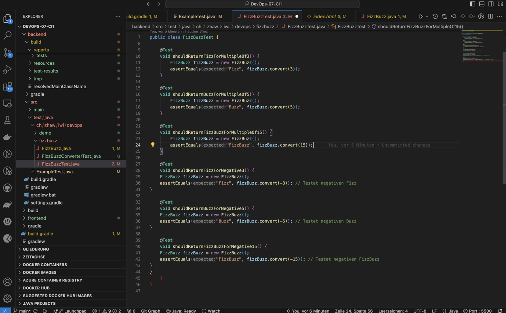
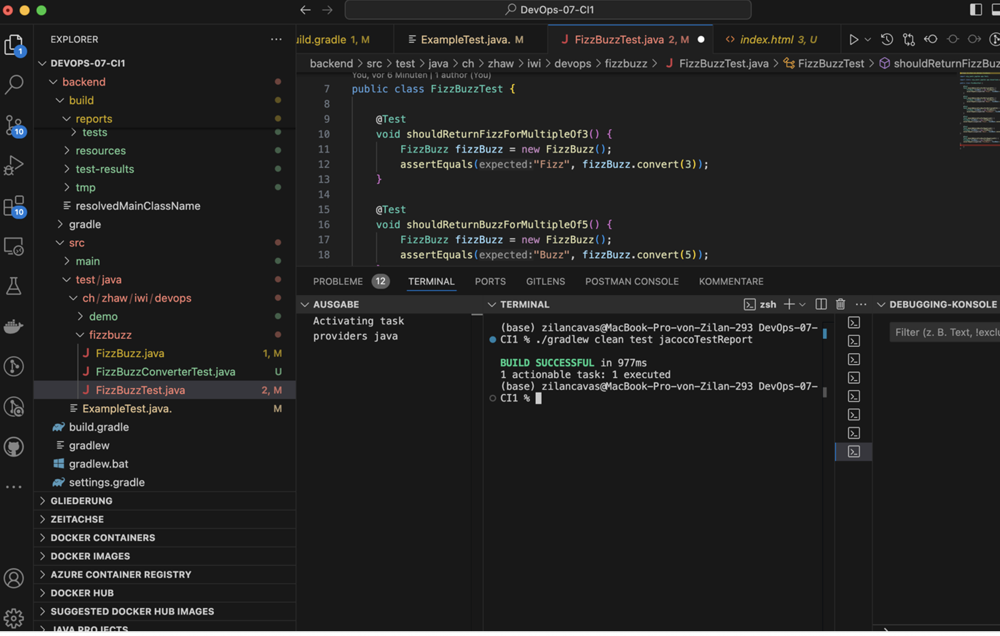
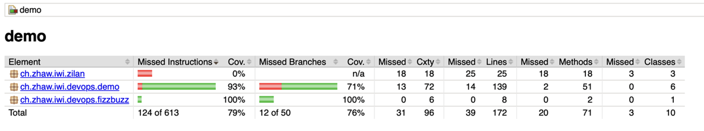
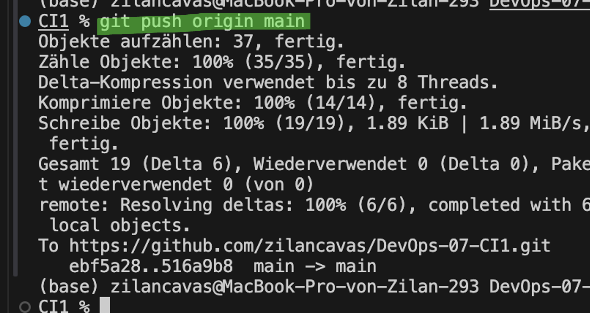

# DevOps 07 CI1

## Lernjournal

| Schritt | Beschreibung | Screenshot |
|--------|--------------|------------|
| 1 | Ich habe ein neues Repository erstellt und die Grundstruktur mit `frontend`, `backend` und `gradle` vorbereitet. Dazu habe ich die `README.md` und `build.gradle` Datei hochgeladen.. |  |
| 2 | Anschliessend habe ich die `build.gradle` Datei angepasst und das `jacoco` Plugin hinzugefügt, um später die Testabdeckung zu messen. Danach habe ich erfolgreich ein erstes Build mit `./gradlew build` durchgeführt. |  |
| 3 | Ich habe die `build.gradle` Datei um die benötigten `dependencies` und den Task `jacocoTestReport` erweitert. Damit wird beim Testen automatisch ein HTML-Report erzeugt. |  |
| 4 | Ich habe in `ExampleTest.java` einen einfachen Unit-Test geschrieben, um JUnit korrekt einzubinden. Der Test wurde mit `./gradlew test` erfolgreich ausgeführt. |  |
| 5 | Der Test wurde mit `./gradlew test` erfolgreich ausgeführt. |  |
| 6 | Anschliessend habe ich die `FizzBuzz` Klasse erstellt und begonnen, verschiedene Testfälle in der `FizzBuzzTest.java` Datei zu schreiben, z. B. für Vielfache von 3, 5 und 15. |  |
| 7 | Ich habe die Methode `convert()` in der `FizzBuzz.java` Datei implementiert, um je nach Eingabe entsprechende Strings zurückzugeben. |  |
| 8 | Nach dem Ausführen der Tests habe ich mit JaCoCo den Coverage-Report geöffnet und überprüft. Die `FizzBuzz`-Tests waren vollständig abgedeckt. |  |
| 9 | Ich habe zusätzliche Testfälle für negative Zahlen implementiert (z. B. `-1`, `-3`, `-5`, `-15`) und so die Testabdeckung weiter erhöht. |  |
| 10 | Ich habe alle Tests nochmals mit `./gradlew test` ausgeführt und anschliessend den JaCoCo-Report mit `./gradlew jacocoTestReport` generiert. Beide Befehle liefen erfolgreich durch, was mir im Terminal als „BUILD SUCCESSFUL“ angezeigt wurde. |  |
| 11 | Ich habe anschließend den generierten Code-Coverage-Report im Browser geöffnet. Im Report wird ersichtlich, dass meine neuen Unit-Tests für die Klasse `FizzBuzz` zu einer vollständigen Testabdeckung (100 %) geführt haben. |  |
| 12 | Ich habe die Testklasse `FizzBuzzTest` erweitert und zusätzliche Tests für negative Eingaben geschrieben, um die Abdeckung weiter zu verbessern. Die Tests prüfen, ob für negative Zahlen wie `-3`, `-5` oder `-15` das erwartete Verhalten (`"Fizz"`, `"Buzz"`, `"FizzBuzz"`) eintritt. |  |
| 13 | Ich habe abschliessend den vollständigen Befehl `./gradlew clean test jacocoTestReport` ausgeführt, um die Tests sauber neu zu starten und die JaCoCo-Reports zu generieren. Der Build war erfolgreich – alle Tests wurden ausgeführt und der Report aktualisiert. |  |
| 14 | Nachdem ich zusätzliche Tests ergänzt und das Projekt neu gebaut hatte, habe ich den generierten JaCoCo-Report erneut geöffnet. |  |
| 15 | Zum Schluss habe ich alle Änderungen mit dem Befehl `git push origin main` auf mein GitHub-Repository übertragen. |  |

## Fazit
In diesem Lernjournal habe ich gelernt, wie man ein Gradle-Projekt mit JUnit-Tests und JaCoCo-Coverage konfiguriert. Ich konnte Unit-Tests schreiben, die Codeabdeckung messen und den Report als HTML-Datei visualisieren. Ich habe ein gutes Verständnis für automatisiertes Testen und Codequalität im DevOps-Kontext aufgebaut – eine wichtige Grundlage für Jenkins und CI/CD.

Herausforderungen waren:
- Zusammenspiel von `test` und `jacocoTestReport`
- Testabdeckung aller Codepfade sicherstellen
- Nur relevante Dateien ins Git-Repo pushen
