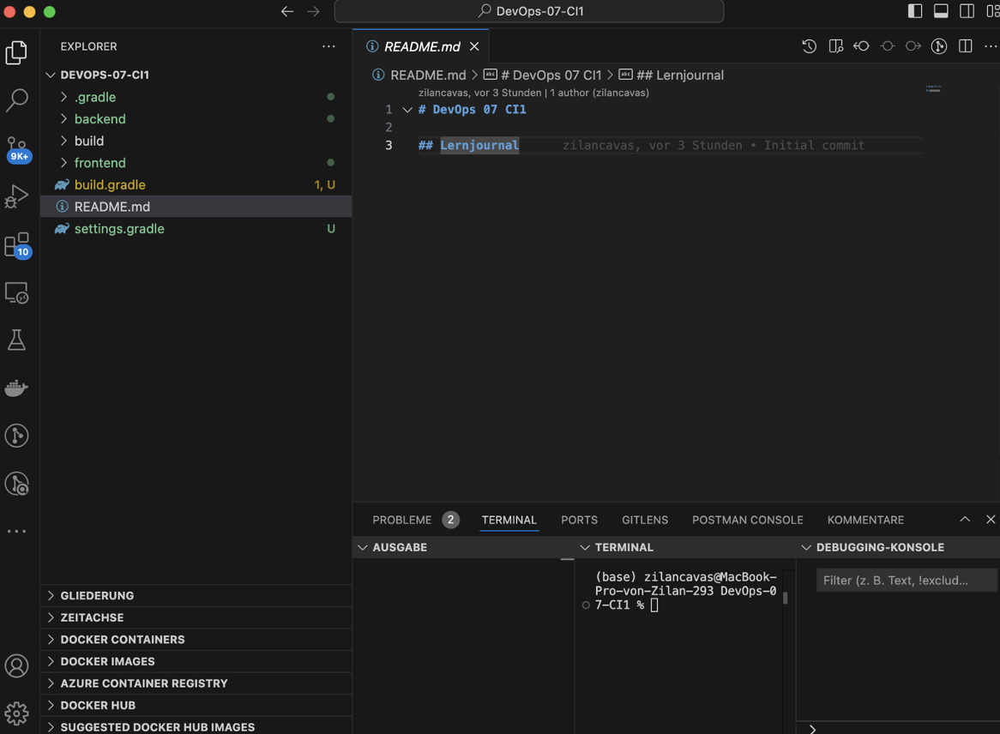
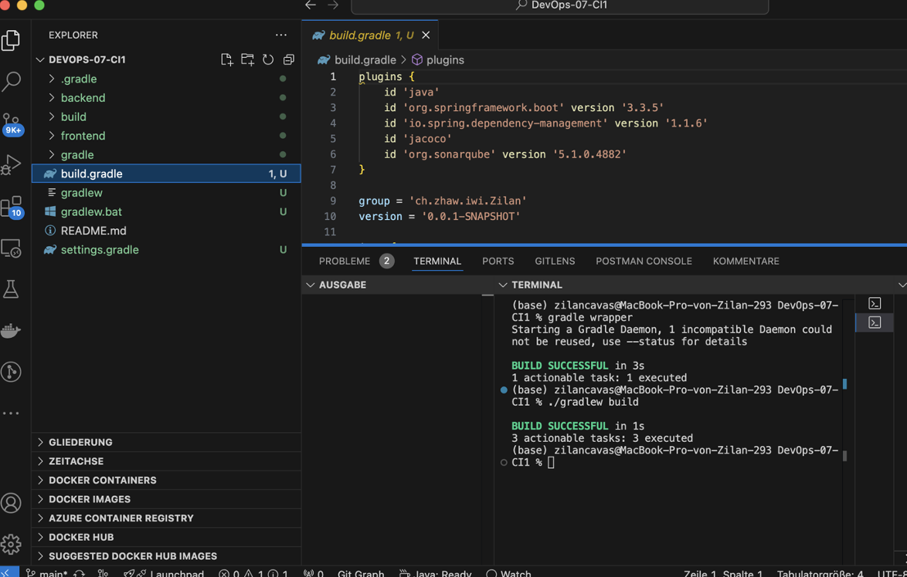
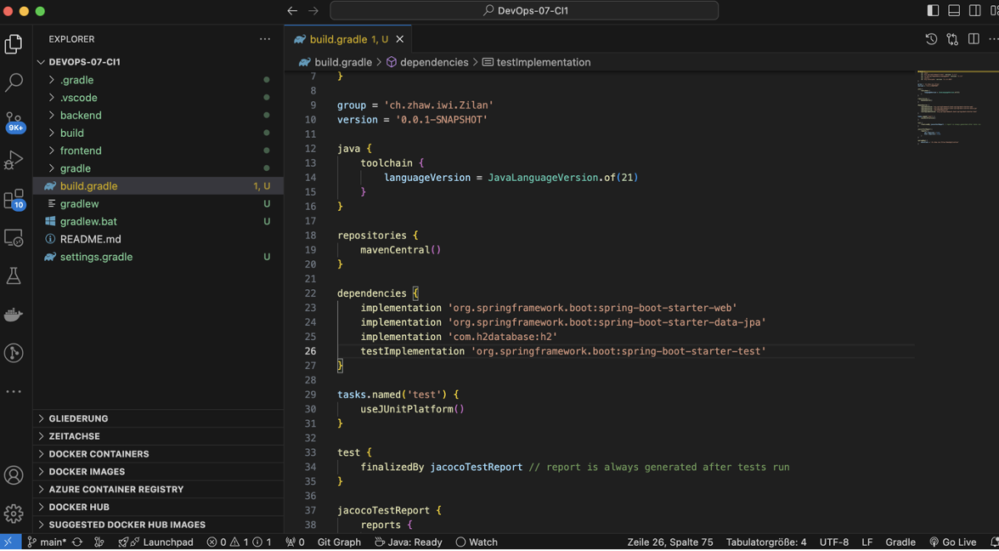
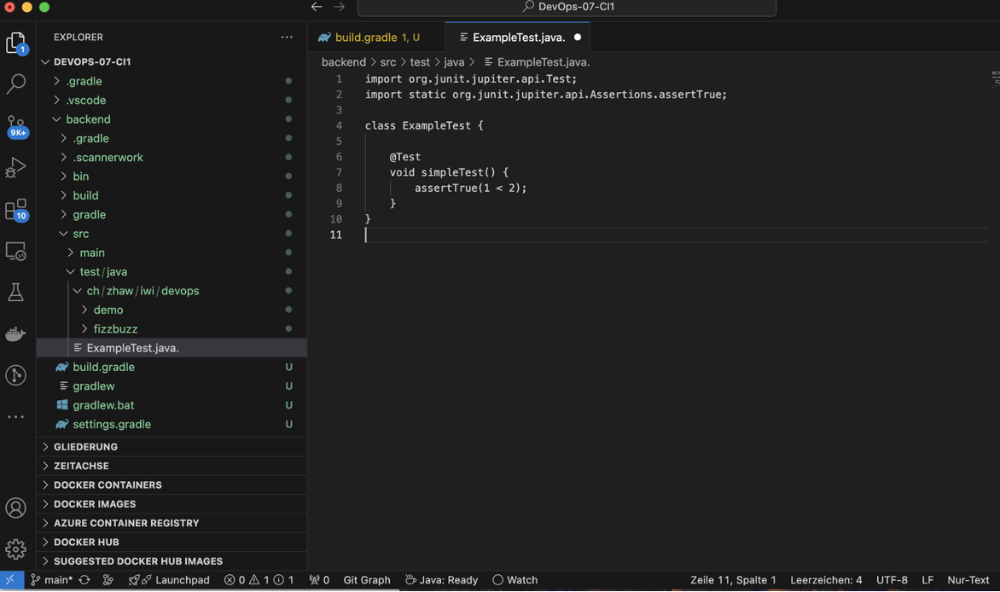
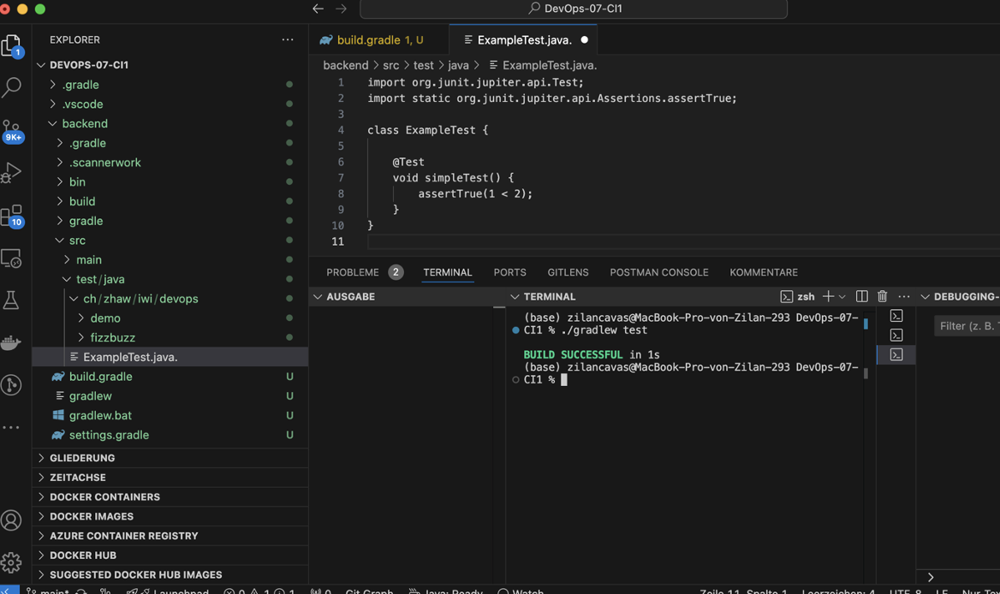
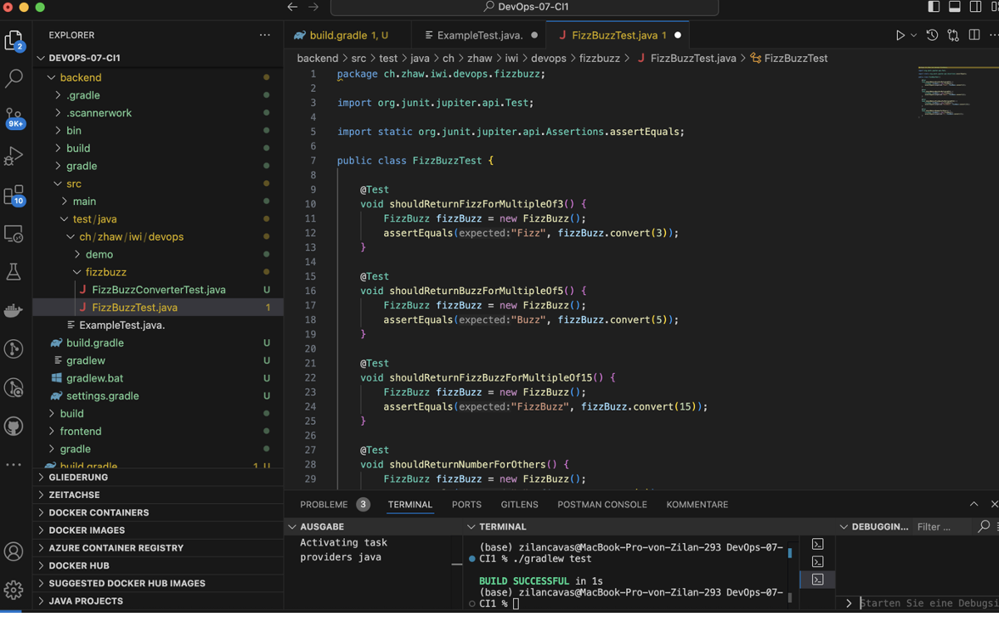
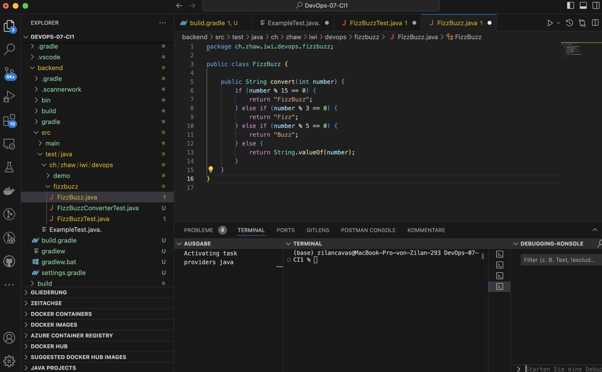
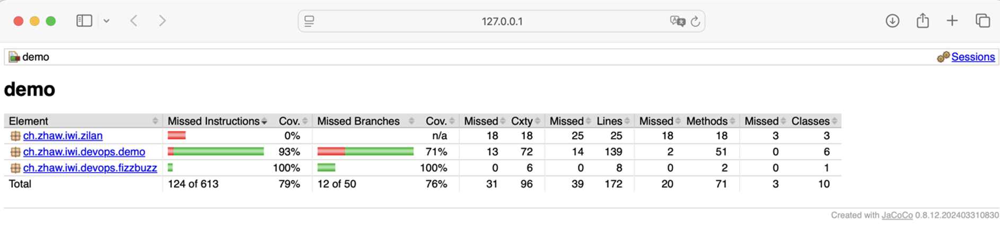
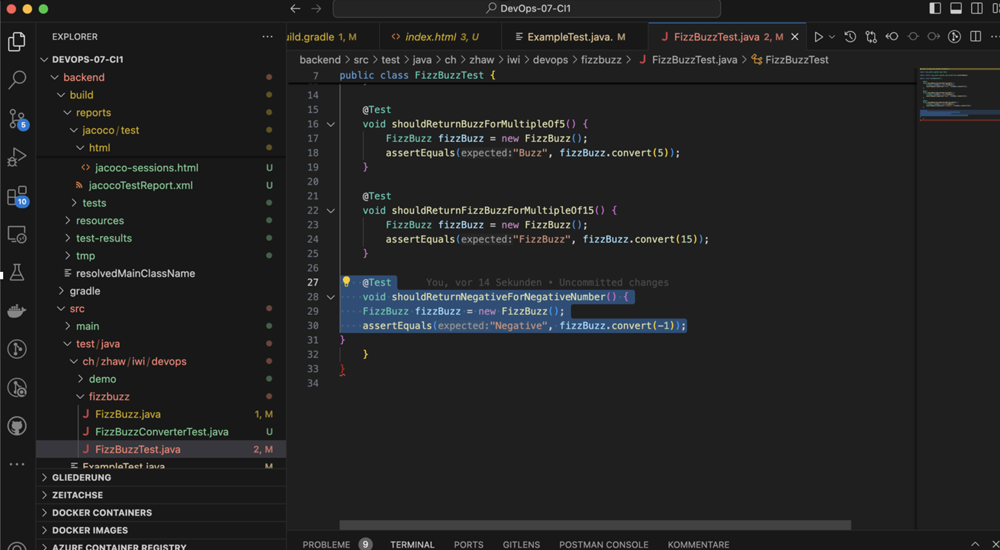

# DevOps 07 CI1

## Lernjournal

| Schritt | Beschreibung | Screenshot |
|--------|--------------|------------|
| 1 | Ich habe ein neues Repository erstellt und die Grundstruktur mit `frontend`, `backend` und `gradle` vorbereitet. Dazu habe ich die `README.md` und `build.gradle` Datei hochgeladen.. |  |
| 2 | Anschliessend habe ich die `build.gradle` Datei angepasst und das `jacoco` Plugin hinzugefügt, um später die Testabdeckung zu messen. Danach habe ich erfolgreich ein erstes Build mit `./gradlew build` durchgeführt. |  |
| 3 | Ich habe die `build.gradle` Datei um die benötigten `dependencies` und den Task `jacocoTestReport` erweitert. Damit wird beim Testen automatisch ein HTML-Report erzeugt. |  |
| 4 | Ich habe in `ExampleTest.java` einen einfachen Unit-Test geschrieben, um JUnit korrekt einzubinden. Der Test wurde mit `./gradlew test` erfolgreich ausgeführt. |  |
| 5 | Der Test wurde mit `./gradlew test` erfolgreich ausgeführt. |  |
| 6 | Anschliessend habe ich die `FizzBuzz` Klasse erstellt und begonnen, verschiedene Testfälle in der `FizzBuzzTest.java` Datei zu schreiben, z. B. für Vielfache von 3, 5 und 15. |  |
| 7 | Ich habe die Methode `convert()` in der `FizzBuzz.java` Datei implementiert, um je nach Eingabe entsprechende Strings zurückzugeben. |  |
| 8 | Nach dem Ausführen der Tests habe ich mit JaCoCo den Coverage-Report geöffnet und überprüft. Die `FizzBuzz`-Tests waren vollständig abgedeckt. |  |
| 9 | Ich habe zusätzliche Testfälle für negative Zahlen implementiert (z. B. `-1`, `-3`, `-5`, `-15`) und so die Testabdeckung weiter erhöht. |  |
